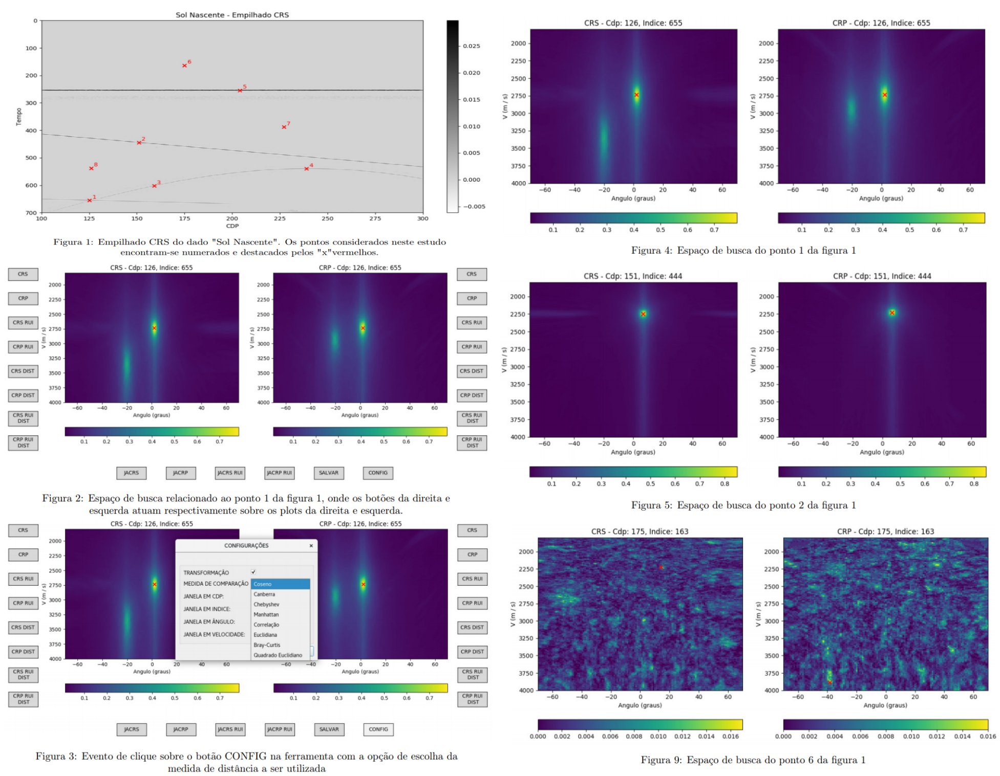
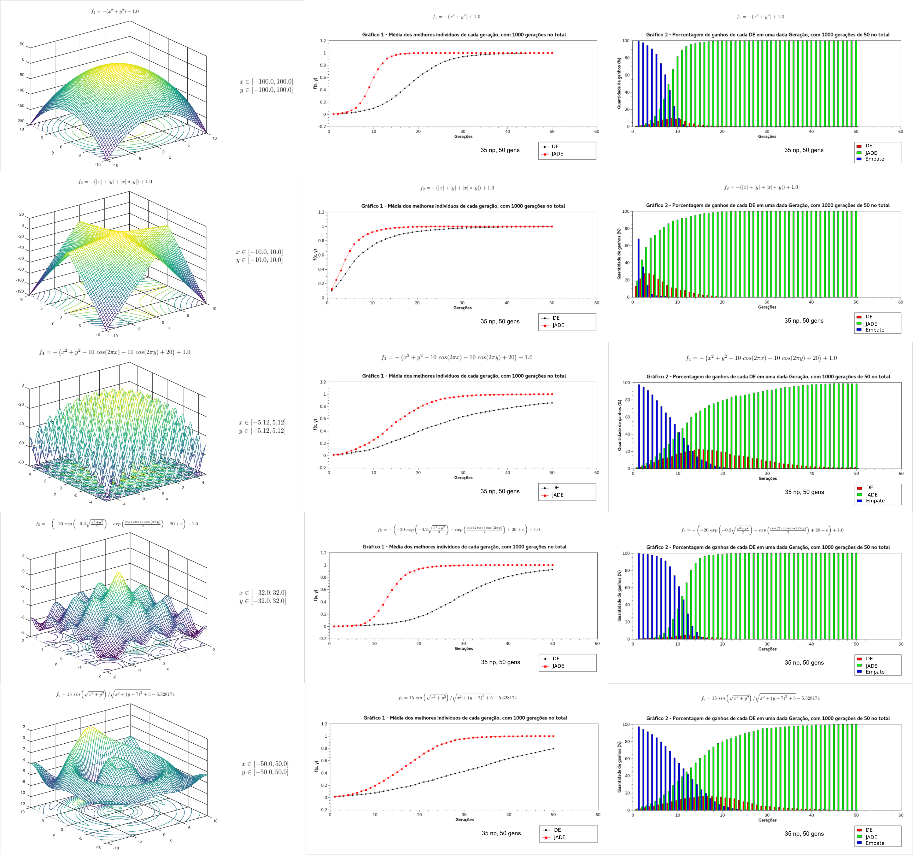

# mc040
**Scientific Research from my work at Cepetro (Unicamp), guided by Tiago Coimbra and Prof. Edson Borin**

In this scientific research I studied two things: 1) geophysical algorithms, such as Common Reflection Surface (CRS) and Common Reflection Point (CRP), and their input parameters using Python visualization tools. 2) The improvements brought by [Adaptive Differential Evolution (JADE)](https://ieeexplore.ieee.org/document/5208221) heuristic when compared with [Differential Evolution (DE)](https://en.wikipedia.org/wiki/Differential_evolution#:~:text=In%20evolutionary%20computation%2C%20differential%20evolution,a%20given%20measure%20of%20quality.) to solve geophysical optimization problems.

For the first topic of study, I present this [report](final-report-mc040.pdf) (in portuguese) and the [screenshots](screenshots.png) for the User Interface developed (using Python3 and PyQt) used to analyse the input parameters of CRS and CRP. Due to confidentiality issues, the code can not be made public.

For the second topic of study, I present this [screenshot](screenshots_pt2.png) where both JADE and DE are benchmarked through multiple multivalued functions. Also, I present two published abstracts and presented in conferences:

* **Accelerating seismic parameter estimation with Adaptive Differential Evolution (JADE) and graphics processingunits (GPUs):** Poster presentation of abstract at the 4th EAGE Workshop on High Performance Computing for Upstream, heldin Dubai, United Arab Emirates, October 7-9, 2019. DOI: 10.3997/2214-4609.201903298

* **Using Adaptive Differential Evolution algorithm to improve parameter estimation in seismic processing:** Oralpresentation of abstract at the 16th International Congress of the Brazilian Geophysical Society, held in Rio de Janeiro, Brazil,August 19-22, 2019. DOI: 10.22564/16cisbgf2019.182

Those two papers, describes the use of JADE to solve geophysical optimization problems (both in CPU and on GPU).

**1) Summary of the First Topic of study:**

The Differential Evolution meta-heuristic is used in the analysis of seismic data to search for parameters of equations of transit times quickly and efficiently. However, the reliability of the parameters obtained by this heuristic may be compromised due to the problems that arise in situations of low signal / noise ratio. On the other hand, a high confidence in these parameters makes the decisions of a geophysicist more assertive. In this work, the study of the reasons that generate this low confidence is done through the construction of a new measure. The study is carried out with the help of tools developed in Python, having as main functionality the generation of search spaces for these parameters and their correlation with their neighbors. Consequently, such a correlation results in a
new search space, which is more stable in relation to the originals, in which both the form and the values that compose it are evaluated. Therefore, there is a direct similarity between its format and some of its neighbors, making the format of the search space directly related to the number of events that intersect the same point on the data. In this way, it is possible to increase the confidence of the value obtained by the heuristic. Finally, numerical results confirm that the proposed approach has the potential to raise the quality of results in decision making.

**1) Screenshots of the application developed related with the 1st topic of study:**

**2) Screenshots of results where JADE and DE are benchmarked in multiple multivalued functions:**

